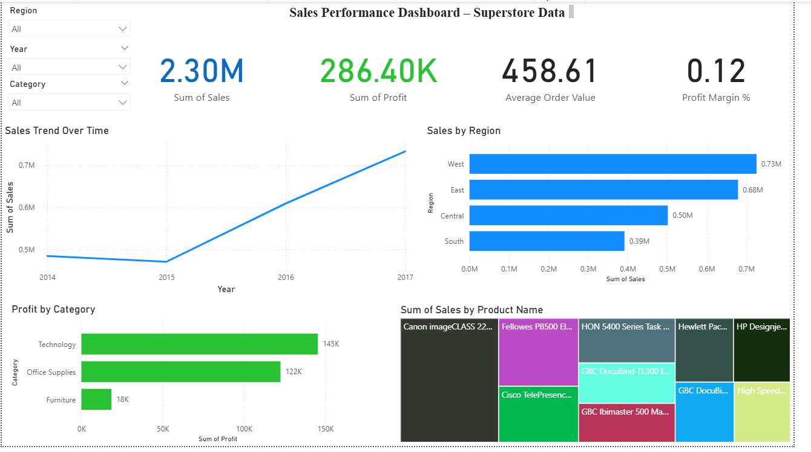

# Sales Performance Dashboard – Power BI

📊 A Power BI dashboard analyzing **sales performance** across regions, categories, and products using the Superstore dataset.  
Includes **SQL preprocessing** and **DAX measures** for KPIs.

---

## 🚀 Project Highlights
- KPI cards showing **Total Sales, Total Profit, Average Order Value, and Profit Margin %**  
- Trend analysis of **Sales over Time**  
- **Profit by Category** and **Sales by Region** comparisons  
- Top 10 products by sales using SQL + visualization in Power BI  
- Interactive filters (Year, Region, Category)

---

## 🛠️ Tech & Skills Demonstrated
- **Power BI**: Data cleaning, visuals, DAX measures, KPI cards  
- **SQL**: Aggregations, grouping, ranking (see [`sales_queries.sql`](sql/sales_queries.sql))  
- **DAX**: KPI calculations (see [`dax_measures.md`](docs/dax_measures.md))  
- **Data storytelling**: Clear dashboard layout with slicers  

---

## 📄 Documentation
The full business and technical documentation for this project is available here:
[Download Sales_Performance_KPI_Dashboard_Documentation.docx](./Sales_Performance_KPI_Dashboard_Documentation.docx)

It includes:
- Business problem & objectives
- Data model and DAX calculations
- KPI definitions and dashboard visuals
- Impact and ROI summary

---

## 📂 Files in Repo
- `Sales_Performance_Dashboard.pbix` → Main Power BI file  
- `Sample_-_Superstore.csv` → Dataset used  
- `dashboard.png` → Dashboard preview  
- `sql/sales_queries.sql` → SQL queries for analysis  
- `docs/dax_measures.md` → Human-readable DAX documentation
- 'Sales_Performance_KPI_Dashboard_Documentation.docx' → Complete business & technical project documentation

---

## 📸 Dashboard Preview

---

## 🔮 Future Improvements
- Add YoY/MoM growth metrics  
- Connect to live SQL database instead of CSV  
- Build automated refresh pipeline
